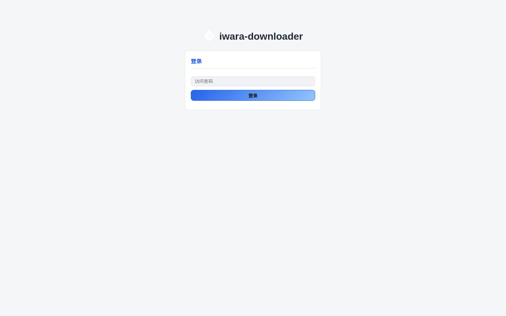
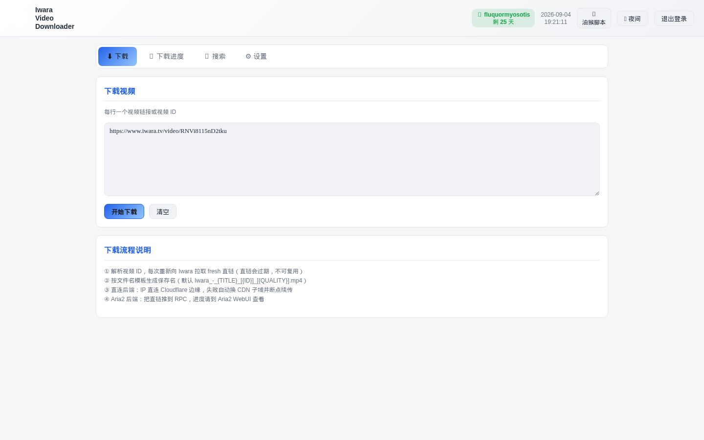
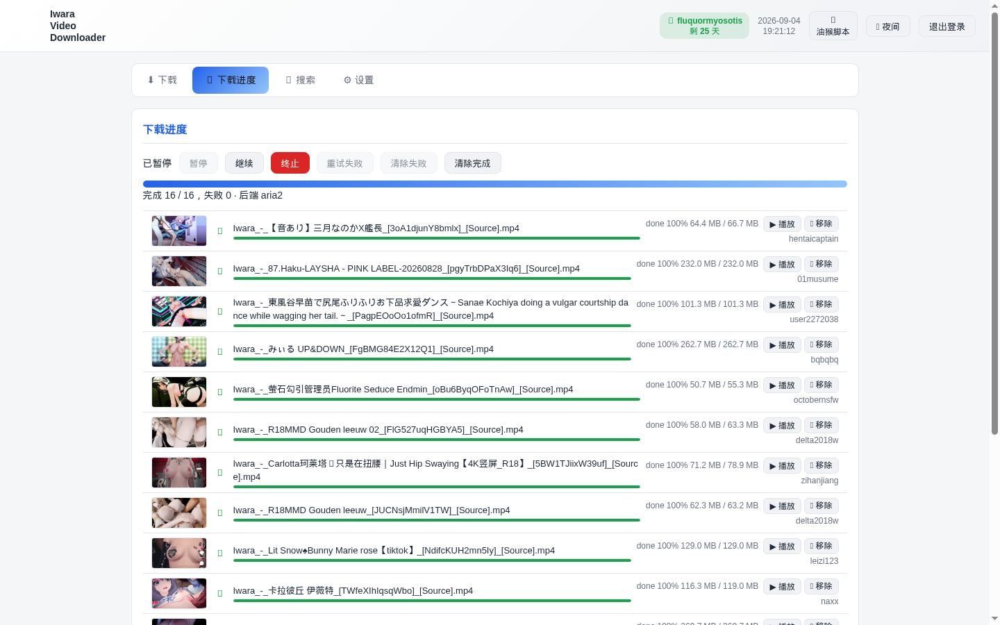
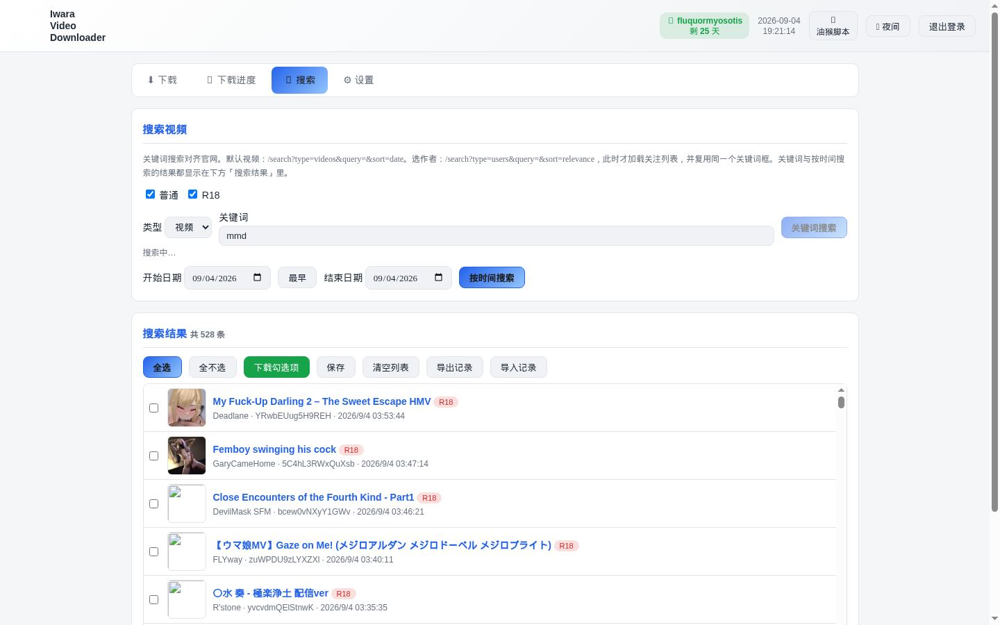
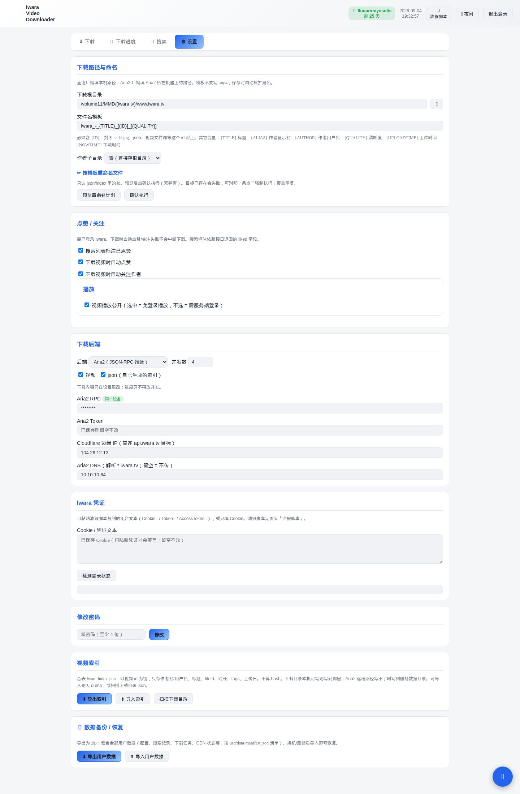
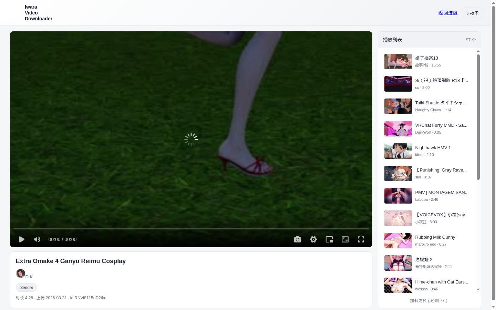
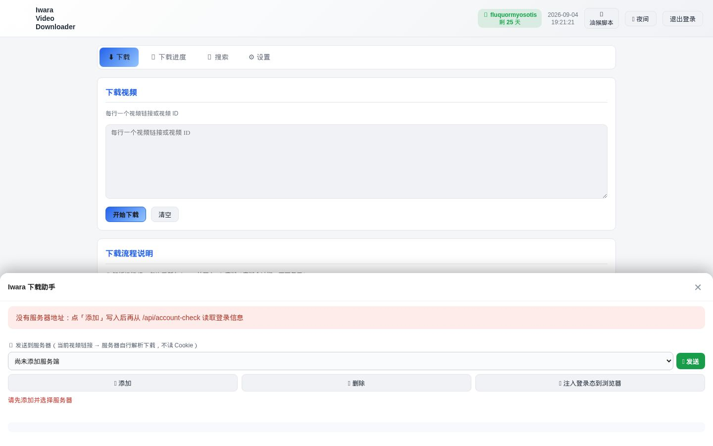

# iwara-downloader-server

> 零依赖、单进程 Node.js 服务：从 [Iwara](https://www.iwara.tv) 搜索、解析并下载视频。
> 自带网页界面（浏览器访问）。

**核心能力一览**

| 能力 | 说明 |
|---|---|
| 🔍 关键词搜索 | 走 Iwara 网页同款 `/search?type=videos&query=`，结果与官网一致 |
| ⬇ 批量下载 | 输入视频 ID / 完整链接，预解析后一键下载 |
| 🔑 凭证双模式 | Cookie / Token（油猴脚本一键采集） |
| 📤 发送到服务器 | 油猴脚本把当前视频链接一键推给服务器添加下载任务（服务端清单：添加后下拉选择，不能改只能删） |
| ▶ 本地播放 | 进度页打开 `play.html`（吸收 ArtPlayer MIT 静态文件，非 npm 依赖）：完整文件或 `.part` 已写入字节都能 Range 播；未下完时进度条只到已缓存部分；右侧索引列表滚动懒加载 |
| 🌐 CF 绕过 | IP 直连（`config.json` 的 `iwaraCfgIp`，默认 `104.26.12.12`）+ SNI + 精简 UA，绕开 DNS 污染与 Cloudflare 拦截 |
| 🔄 CDN 子域轮换 | 失败自动换可用子域；成功/失败列表持久化到本机 |
| 📁 文件名模板 | 学油猴脚本变量替换：`Iwara_-_{TITLE}_[{ID}]_[{QUALITY}]`（不要写 `.mp4`，落盘自动补） |
| 🚀 双下载后端 | `direct`（Node 直连，断点续传）/ `aria2`（JSON-RPC 推送） |
| 📦 启停脚本 | 单脚本子命令 `start.sh [start|stop|restart|status]` + 兼容薄壳 + macOS/Windows 版 |
| ❤️ 收藏 / 关注 | 下载自动点赞/关注（`autoLike` / `autoFollow`）；搜索列表与本地播放页显示真实「已赞 / 已关注」状态（官方列表接口恒返回 liked=false，本服务用本地 `liked_state` 记录并合并展示）；播放页可手动收藏视频 / 关注作者 |
| 👤 作者头像 | 本地 `avatar/<id>/<id>.jpg` 全链路：播放页作者区显示头像圆图；搜索 / 下载自动更新作者索引（`json/profile/`）与头像文件；官方无头像的作者保持空并正确跳过 |

---

## 快速开始

**环境要求**：Node.js 18+（零 npm 依赖，无需安装任何包）。

```bash
# 1. 下载 / 克隆仓库
git clone <仓库地址> && cd iwara-downloader-server

# 2. 复制配置模板（真实配置含凭证，不会入库）
cp server/config.example.json server/config.json
# 编辑 server/config.json：填 iwaraToken 或 iwaraCookie、downloadPath

# 3. （可选）设置访问密码
node server/boot.cjs --set-password "你的密码"

# 4. 启动（无参默认 restart；未运行会直接启动）
./start.sh
# 浏览器打开 http://127.0.0.1:8643
```

> 未设置密码时**只警告、可直接使用**（局域网内任何人可访问，建议尽快设置）。
> 首次启动若没有 `config.json`，会按 `config.js` 的默认值运行；正式使用请从 example 复制后再填路径与凭证。

**启停（POSIX 用 `start.sh`，Windows 用 `start-windows.bat`）**

| 命令 | 作用 |
|---|---|
| `./start.sh` | 重启（默认命令，等价 restart；未运行则直接启动） |
| `./start.sh start [--port 8643]` | 启动（`--port` 优先，缺省读 config.json 的 `port`，再缺省 8643） |
| `./start.sh restart [--port 8643]` | 重启（stop + sleep 1 + start） |
| `./start.sh stop` | 停止（PID 优雅停止 → 兜底清理残留进程） |
| `./start.sh status` | 状态（进程 / PID 文件 / HTTP 健康检查 / 日志） |
| `./start.sh --port 8643` | 兼容旧用法（等价 restart） |
| `./start.sh --set-password "新密码"` | 设置访问密码（不启动服务） |

PID 文件：项目根 `iwara-downloader-server.pid`（不入库）。

`start-linux.sh` / `start-macos.sh` / `start-windows-background.bat` 是薄壳，转发到上面两个主入口。旧名 `stop.sh` / `restart.sh` / `status.sh` 若仍存在，同样转发到 `start.sh`。

终端会自动用绿/黄/红提示（管道或 `NO_COLOR` 时关闭）。日志超过 10MB 在 start/restart 时轮转并 gzip。启动前校验 `server/config.json` 是否为合法 JSON、端口是否在 1–65535。

---

## 网页界面

四个选项卡：**⬇ 下载 / 📊 进度 / 🔍 搜索 / ⚙ 设置**。

| 选项卡 | 功能 |
|---|---|
| 下载 | 每行一个视频 ID 或 `iwara.tv/video/xxxxxx` 链接；可先「预解析」再「开始下载」 |
| 进度 | 暂停 / 恢复 / 停止 / 重试失败；任务不会自动清掉，只能手动从列表移除（不删文件）；每条可本地播放（ArtPlayer，未下完也可播已缓存部分） |
| 搜索 | 关键词（与官网 `?query=` 一致）、排序、可选用户名；勾选后下载 |
| 设置 | 下载路径、文件名模板、作者子目录、后端、Cookie / Token、密码 |

---

## 目录结构

```
├── start.sh / start-macos.sh / start-windows.bat / start-windows-background.bat  # 启停脚本（单脚本子命令）
├── stop.sh / restart.sh / status.sh    # 兼容薄壳 → start.sh
├── scripts/iwara-cred-fetch.user.js  # 油猴凭证采集 + 一键发送
├── userdata-manifest.json            # 用户数据文件清单（备份/恢复按此收集）
└── server/
    ├── app.js                        # 项目 HTTP 入口（装配 + 鉴权门 + 静态 + 启动）
    ├── boot.cjs                      # 零依赖启动器（强制本项目 .js 按 CommonJS 加载）
    ├── config.js                     # 项目配置读取
    ├── config.example.json           # 配置模板（入库）；真实 config.json 不入库
    ├── routes/                       # 项目路由，按域拆分（12 个）
    │   └── auth.js browse.js search.js download.js play.js rename.js
    │       videos.js settings.js account.js data.js index.js auto-update.js
    ├── lib/                          # 项目模块 + 通用运行支撑件
    │   ├── iwara-api.js              # Iwara API（IP 直连 + CF 绕过）
    │   ├── downloader.js             # 下载引擎（direct / aria2 + 子域轮换）
    │   ├── cjs-bootstrap.cjs         # CJS 强制（boot.cjs 与 test/ 共用，模板下发）
    │   └── start.sh                  # 启停脚本本体（模板下发，根目录 start.sh 为入口）
    ├── core/ auth/ config/ http/     # 框架通用件，按功能分层（模板下发）
    │   route/ store/ update/ assemble/
    └── public/                       # 网页前端
```

> `core/` `auth/` `config/` `http/` `route/` `store/` `update/` `assemble/` 与
> `boot.cjs`、`lib/cjs-bootstrap.cjs`、`lib/start.sh` 由 `dl-server-template` 组装下发，
> 本仓库不手工维护；`routes/`、`lib/` 下的其余文件与 `app.js` 是本项目自有代码。
> 二者区分：框架件按功能子目录（`http/path-safe.js`），项目件按领域（`lib/downloader.js`）。

---

## 配置（server/config.json）

记录：**端口、凭证、下载路径、文件名模板、后端（direct / aria2）**。

```json
{
  "port": 8643,
  "iwaraToken": "",
  "iwaraCookie": "",
  "downloadBackend": "direct",
  "downloadPath": "/path/to/your/Iwara/",
  "fileNameTemplate": "Iwara_-_{TITLE}_[{ID}]_[{QUALITY}]",
  "useAuthorSubdir": false
}
```

> ⚠️ **安全说明**：仓库只提交 `server/config.example.json`（示例路径、空凭证）。
> 真实配置（含 token / cookie / 本机路径 / 密码哈希）保存在本地 `server/config.json`，已被 `.gitignore` 忽略，**不会上传**。
> 首次使用：复制 example 为 `config.json` 后填写，或在网页「设置」中保存。

| 字段 | 说明 |
|---|---|
| `iwaraToken` | Iwara refresh_token（油猴脚本复制） |
| `iwaraCookie` | 完整 Cookie（含 cf_clearance；HttpOnly 需油猴 `GM_cookie`） |
| `downloadBackend` | `direct`（默认）或 `aria2` |
| `downloadPath` | 下载根目录。`direct` 为本机路径；`aria2` 为 **aria2 所在机器**上的路径 |
| `fileNameTemplate` | 文件名模板，变量见下表 |
| `useAuthorSubdir` | 是否按作者建子目录（默认 `false`） |
| `concurrency` | 直连并发数 |
| `aria2Path` | Aria2 JSON-RPC 地址 |
| `aria2Token` | Aria2 RPC 密钥（不含 `token:` 前缀，代码会自动加） |
| `port` | HTTP 端口（默认 8643） |

**文件名模板变量**（学油猴脚本 `downloadPath.ts`）：

| 变量 | 含义 |
|---|---|
| `{TITLE}` | 标题 |
| `{ALIAS}` | 别名 |
| `{ID}` | 视频 ID |
| `{AUTHOR}` | 作者 |
| `{QUALITY}` | 清晰度（如 Source / 540） |
| `{UPLOADTIME}` | 上传时间 |
| `{NOWTIME}` | 当前时间 |

默认：`Iwara_-_{TITLE}_[{ID}]_[{QUALITY}]`（不要写扩展名，落盘自动补 `.mp4`）  
**必须含 `{ID}`**：封面 `server/thumbs/<id>.jpg`、sidecar json、视频文件都靠这个 id 对上。设置页保存时缺 `{ID}` 会拒绝。  
例：`Iwara_-_耀佳音与知更鸟摇一摇_[ZsvQjWn9XNQvAy]_[Source].mp4`

---

## 凭证获取

浏览器安装 `scripts/iwara-cred-fetch.user.js`（或打开服务器 `/userscript`）：

1. 打开并登录 [iwara.tv](https://www.iwara.tv)（等 Cloudflare 挑战完成）
2. 点页面右下角 🎫 按钮
3. 一键复制完整 Cookie / Token，粘贴到网页「设置」保存

---

## 发送到服务器（一键把视频推给服务器下载）

油猴脚本（v7.1.0+）「📤 发送到服务器」：

1. 打开任意 iwara 视频页（如 `https://www.iwara.tv/video/eBTWBPRSTFkahe`）
2. 点右下角 🎫 按钮，填服务器地址（`192.168.1.10:28463` 或 `http://192.168.1.10:28463` 均可，没写协议会自动补 `http://`），点 **📤 发送**
3. 脚本行为：
   - 探测 `GET /api/status`；
   - 服务器设了密码则用本地保存的服务器密码 `POST /api/login` 自动登录；
   - 把**当前视频完整链接** `POST /api/receive`（内部转发给 `/api/download`，服务器自行解析 ID 并下载）；
   - 地址/密码可「💾 记住地址」固化。
4. 面板顶部按香蕉网脚本风格显示登录态：已登录 / 用户名 / 用户 id / 主页链接 / Cookie 诊断。

> `/api/receive` 接受 `{ url }` / `{ urls }` / `{ items }` / `{ text }`，解析只走 `/api/download` 一处。

---

## 作者头像与索引（完整流程）

播放页作者区头像走**本地全链路**：`json/profile/<username>.json` 索引记录作者信息（`name` / `profile` / `avatar` 相对路径），头像文件存在项目根 `avatar/<id>/<id>.jpg`，前端 `renderAuthor` 渲染 ``。官方 API 一律不直接透传头像 URL，只取头像 id 拼本地路径。

**1. 索引如何建立 / 更新（自动，无需手工）**

- 搜索时：`search-cache.js` 写搜索缓存时调 `profileIndex.upsertFromVideo(v)`，新作者自动建索引；
- 下载时：`downloader.js` 的 `prepareVideoInfo` 调 `profileIndex.upsertFromInfo(info)`；
- 启动时：`downloader.js` 模块加载末尾调 `profileIndex.backfillMissing()`，为「已下载但没建索引」的作者补索引（只补 json 缺失的作者，不重查已有索引）。
- `upsertFromUser` 的更新策略：**文件已存在且 `name` 没变就跳过**（不重查官方），除非 name 变了或文件缺失。头像字段提取官方 `user.avatar.id` → 拼 `/avatar/<id>/<id>.jpg` → 若本地文件缺失则 `saveAvatarFile` 下载（`GET /image/avatar/<id>/<id>.jpg`，写入 `avatar/<id>/<id>.jpg`，`.part` 临时文件 + rename，32B 以下或官方占位图丢弃）。写索引后同步 `patchCatalog` 更新总表 `json/profile/iwara-profile.json`。

**2. 播放页如何取头像**

`/api/play-info` 的 `avatar` 字段：`profileIndex.readEntry(username)` → `avatar` → `avatarExists(rel)`（文件存在且 >32B）→ 返回相对路径 `/avatar/<id>/<id>.jpg`。前端 `renderAuthor`：字段非空且匹配 `/^\/avatar\/[0-9a-f-]+\/[0-9a-f-]+\.jpg$/i` 才渲染 ``，图片 onerror 自动隐藏。

**3. 已知边界（实测确认）**

- **官方 avatar=null 的作者**（如 jk4、hannana298）：本地索引 avatar 为空是**正确行为**，不是漏下载——官方 `GET /profile/{u}` 的 `user.avatar` 就是 null。前端不渲染头像，页面作者区只显示名字。
- **官方后上传头像不自动刷新**：因「文件已存在且 name 没变就跳过」，若某作者先以无头像建了索引、官方后来才上传头像，本地不会自动补拉。需删除 `json/profile/<username>.json` 或等 name 变化才会重查。
- **头像文件缺失但索引有值**：`saveAvatarFile` 下载失败（网络 / 官方 404）时索引仍会写入 avatar 路径，但 `avatarExists` 校验失败 → play-info 返回空 → 前端不渲染，不影响其它功能。
- 前端脚本语义验证：`test/test-author-avatar.cjs` 以 jsdom `<script>` 内联方式（真实浏览器 script 语义，非 `win.eval`）加载真实 `play.html` body + `play-list.js` / `play-enhance.js` / `play-app.js` 三件套，断言 `#author` 渲染 `` 且无 JS 报错；新旧项目 `renderAuthor` 同数据渲染对比。

---

## 下载后端

### direct（默认）

本机 Node 直连下载：每次重新解析 **fresh 直链**（链接会过期），IP 直连 Cloudflare 边缘，失败自动换 CDN 子域。支持 Range 断点续传。

### aria2

把 fresh 直链通过 JSON-RPC `aria2.addUri` 推给 aria2。`downloadPath` 必须是 **aria2 机器上的路径**。

群晖 DSM Aria2 套件示例：

```json
{
  "downloadBackend": "aria2",
  "aria2Path": "https://nas.local:5001/webman/3rdparty/Aria2/aria2rpc_proxy.cgi",
  "aria2Token": "你的RPC密钥",
  "downloadPath": "/volume1/downloads/"
}
```

aria2 进程自己做 DNS。若本机 DNS 污染 iwara 子域，需在 **aria2 所在机器** 配 hosts，或用群晖 **DNS Server** 套件把 `iwara.tv` 通配 A 记录指到 `104.26.12.12`，并把该机系统 DNS 指到本机 `127.0.0.1`。常见处理见下方「常见问题」。

---

## 版本

| 版本 | 内容 |
|---|---|
| 1.7.13（未升版） | **播放页点赞/关注按钮补齐取消能力（toggle）+ 措辞「收藏→点赞」**：①后端新增 `unfollowUser`（`DELETE /user/{id}/followers`，照 `unlikeVideo` 的 DELETE 封装姿势：401 重试刷新 token、400/404/409/422 视为成功）+ `like-state.markUnfollowed`（同步删本地 `liked_state.json` 记录）+ 路由 `DELETE /api/follow?userId=`。②前端 `bindStateButtons` 改 toggle：按 `btn.dataset.on` 判断当前态——已开启点一下发 DELETE（取消点赞/取关）、未开启点一下发 POST（点赞/关注），成功才翻转按钮态，3 秒冷却保留；`refreshVideoState` 点亮标签「❤️ 已点赞」、`play.html` 初始态「❤️ 点赞」（统一改「点赞」措辞）。③`assemble.json` 补三条下发条目：`_iwara-style/server/lib/iwara-api.js`、`like-state.js`、`server/routes/like.js` 进模板（后端配套随风格包下发，前端按钮有后端才能完整工作）。验证：真实部署环境实测官方 `POST/DELETE /user/{id}/followers`（cookie 103B 下 200）、`unlikeVideo` DELETE 200（同款封装姿势确认）；后端三文件 + 前端 `node --check` 通过；模板 `play-app.js`/`play.html`/`server/lib`/`server/routes` 已同步 |
| 1.7.12（未升版） | **头像全链路实测确认 + README 补「作者头像与索引」完整流程**：真实部署环境实测三个视频的 play-info → avatar 字段/格式 → 头像文件 HTTP 200 → 前端 jsdom 真实 script 语义渲染 ``，11/11 全过，确认前端无回归。实测确认：官方 `GET /profile/{u}` 的 `user.avatar` 为 null 的作者（jk4、hannana298 等）本地索引为空是**正确行为**，非漏下载；搜索/下载/启动三处自动更新作者索引（`upsertFromVideo` / `upsertFromInfo` / `backfillMissing`）；已索引作者「文件在且 name 没变」跳过重查 → 官方后上传头像不自动刷新（边界记录在 README 头像章节）。`test/test-author-avatar.cjs` 升级为前端级：jsdom `<script>` 内联加载真实 play.html body + 三件套（`initPlayTools` 全局可见），替代原 `win.eval` 方式 |
| 1.7.11（未升版） | **真实环境实测修复三处 + 收藏/关注限频**：①**搜索列表仍不显示已收藏**——上一版只在「本服务操作后」记本地状态，历史真实收藏（官方 `/videos?liked=1` 实测 240 条）从未回填。现在：**保存凭证（cookie/token）验证登录成功后，后台全量拉一次「我的已赞」（`listLikedAll`）+「我的关注」（`syncFollowedAll`，复用 `following_cache.json` 增量缓存）写入本地 `liked_state.json`，之后全靠运行时增量（`markLiked`/`markFollowed`），不再全量分页**。②**播放页作者头像不显示 + 收藏/关注按钮不可用**——`/api/play-info`、`/api/video-state` 原注册为需鉴权路由，播放页未登录时被分发层 401 拦截（handler 内的 `playPublic` 检查根本没执行）。改为**公开路由**（`routePublic`）：`play-info` 内部仍按 `playPublic` 配置检查；`video-state` 未登录时返回本地已赞/已关注状态 + 官方详情（服务端用自己 token 拉），按钮初始态可看。③**手动收藏/关注不写本地状态**——播放页按钮 `POST /api/like`（成功 `markLiked`）、`DELETE /api/like`（`markUnliked`）、`POST /api/follow`（`markFollowed`）现在同步写 `liked_state.json`，刷新后搜索列表 badge 立即可见。④**收藏/关注限频**——播放页按钮点击是真实官方接口调用，点击后 3 秒冷却（`stateBtnCooldown`，成功/失败都冷却），防误点连续轰炸官方 API。验证：like-state 批量/取消单测、video-state 未登录返回本地状态（200）、播放页按钮 jsdom 全链路（初始态点亮 / 连点 5 次仅 1 次 POST / 401 提示未登录）、全接口回归 200。模板 `_iwara-style/public/play-app.js` 已同步 |
| 1.7.10（未升版） | **修复搜索列表「已收藏 / 已关注」不显示 + 播放页补「收藏 / 关注」按钮**。根因：官方 `/videos` 列表接口与 `/search` 接口对所有视频恒返回 `liked:false`、`following:false`（即使真实已赞/已关注，只有详情接口 `/video/{id}` 返回真实值），搜索缓存直接把假值存进 `json/search_cache.json`，前端「❤️ 已赞 / 已关注」badge 永不出现。**服务端**：新增 `server/lib/like-state.js`（本地已赞/已关注状态持久化 `json/liked_state.json`），`autoLikeFollow` 成功、播放页手动收藏/关注都写入；搜索缓存 `normalizeVideo` 与 `/api/search-status` 返回前用本地状态合并真实值；新增 `GET /api/liked-state`（一次拉取本地集合）、`POST /api/like`、`DELETE /api/like`、`POST /api/follow`、`GET /api/video-state`（播放页按钮初始态，官方详情 + 本地兜底）、`iwara-api.getVideoState` 轻量状态查询。**前端**：搜索流程与下载轮询定期刷新本地状态，liked 变化即重绘对应搜索列表（`server/public/app.js` 的 `resultItemHtml` 以 `likedMeta.liked` / `likedMeta.followed` 兜底 badge）；播放页 `.player-author` 新增「❤️ 收藏 / + 关注」按钮（`play.html` + `play-app.js`，点击即时翻转按钮态）。验证：like-state 单测（写/合并）、搜索 badge 四态渲染（已赞/已关注显示、未赞/未关注不显示）、播放页按钮全链路（video-state 拉取 → POST like/follow → 按钮翻转）jsdom 实测通过；全接口回归 200。对应模板 `_iwara-style/public/play.html`、`play-app.js` 已同步 |
| 1.7.9（未升版） | **播放页测试脚本纳入组装下发（模板 `_iwara-style`）**：`assemble.json` 新增 `server/templates/_iwara-style/test/ → test/` 整目录条目，模板侧测试脚本随组装同步进项目——`test/play-test.cjs`（播放页行为验证：驱动 headless 浏览器模拟倍速循环 / 长按快进 / 拖动进度条 seek / 排序与折叠 / 自动连播等交互，逐条断言 DOM 状态，无需看图即可判断画面是否真变了）、`test/play-record.cjs`（交互录屏：关键状态保帧 + 截图导出，供 ffmpeg 合成动图）。两个脚本参数全参数化（浏览器可执行文件、被测服务地址、视频 id、会话 cookie、输出目录均经环境变量传入），输出目录带删除守卫 |
| 1.7.8（未升版） | **本地播放页：自动连播 + 排序维度互斥 + 正/倒序 + 文件夹分组 + 拖动进度条（模板 `_iwara-style` 同步）**：①自动连播开关（默认开，播完自动播下一个、列表末尾停止，localStorage 记忆）；②排序「时间」「名称」互斥按钮（分段控件选中高亮）+ 「↓ 倒序 / ↑ 正序」方向切换，均 localStorage 记忆；③列表按文件夹分组折叠（组标题可折叠、显示组内数量，根目录显示「根目录」）；④autoplay 被浏览器拦截时点击画面即播；⑤左键/touch 长按画面不再误弹「播放速度/画面比例/统计信息」右键面板（按住期间抑制 contextmenu，右键菜单保留），桌面端按住画面左右拖动即可拖进度条 seek（拖动超过 10px 自动取消长按快进）。**服务端改动**：`server/lib/video-index.js` 的 `listCatalog` 为每条视频附加 `rel` 字段（相对下载目录的路径，根目录为空串，含作者子目录时即文件夹名），`/api/index` 随之输出 |
| 1.7.7（未升版） | **本地播放器交互增强（模板 `_iwara-style` 下发）**：①**长按画面 3x 快进**——移动端走 ArtPlayer 官方 `fastForward`（长按 1 秒→3x）；桌面端自实现（按住 600ms→3x、松开恢复原速，长按结束的 click 已拦截，不误触发「单击暂停」）；②**控制条倍速按钮**——右上角新增，点击在 1x→1.25x→1.5x→2x→3x 间循环，按钮文字随倍速实时同步（设置面板/快捷键改速也会同步）；③**控制条自动隐藏延长到 8 秒**（默认 3 秒太短，容易误以为没有进度条）。改动仅 `server/public/play-app.js`（与模板 `server/templates/_iwara-style/public/play-app.js` 同源）。验证：headless 真实页面渲染 + 事件模拟全过（倍速循环、长按 3x 松开恢复不误暂停、短按单击暂停保留、无 JS 报错） |
| 1.7.6 | **修复 `/api/download` 报 `file is not defined`（下载完全不可用）**：根因是「作者子目录并入文件名模板」那次重构——`makeTaskItem` 里原来的`const file = sanitizeFileName(...)` 被换成 `const rel = String(it.file || ...)`（让 rel 承载含作者目录的相对路径），但返回对象里的简写 `file,` 没跟着改，简写指向已不存在的变量。`item.file` 下游用途很广（拼 aria2 目录、算 sidecar 名、判断是否已下载），所以整个入队直接抛错。改为 `file: rel`。此前没测出来是因为 config.json 里 `downloadPath` 为空时，代码在 `makeTaskItem` 之前就返回了。②日期范围模块归位 `framework/search/`，`server/assemble/search-date-range.cjs` → `server/search/search-date-range.cjs`，`app.js` 引用随之更新。验证：入队成功并落盘（file='abc123.mp4'）、HTTP 层不再报错、`node --test test/p0-smoke.test.cjs` 26/26 通过 |
| 1.7.5 | **框架目录按功能分层**：`server/framework/` 平铺 23 个文件 → 8 个功能子目录（`core/` `route/` `auth/` `http/` `config/` `store/` `update/` `assemble/`），`cjs-bootstrap.cjs` 归入 `server/lib/`（原先落在 `framework/` 且不在清单里，`test/helpers/test-log.cjs` 直接引它、等于组装不保证存在）。①`assemble.json` 由整目录条目改为 30 条逐文件条目；②迁移工具改写相对引用 34 处（14 个文件），另手工修 `server/app.js` 的 8 处——它是项目自有入口、不在清单里，工具不会碰它；③同步模板版 `update/auto-update.js`：原写法 `try{require(A)}catch{require(A)}` 两分支相同（等于没兜底），模板改为按已知相对路径逐个试 + 祖先链兜底，且用 `_frameworkSearchDirs()` 按目录特征定位，框架内部再调布局也不用改；④README 目录结构同步实际布局。验证：启动正常、42 路由可达、`node --test test/p0-smoke.test.cjs` 26/26 通过 |
| 1.7.4 | **作者子目录并入文件名模板**（模板 v1.7.0）：原先「作者子目录」是独立开关 `useAuthorSubdir`，与 `fileNameTemplate` 各管一半；现模板里的 `/` 直接作目录分隔，写 `{AUTHOR}/Iwara_-_{TITLE}_[{ID}]_[{QUALITY}]` 即按作者分目录、不写则存下载根目录，开关整体移除（`config.js` / `config.example.json` / `routes/settings.js` / 设置面板下拉 / `app.js` 两处引用一并清理）。实现要点：`applyFileNameTemplate` 把结果按 `/` 分段、逐段 `sanitizeFileName`（原先整串 sanitize 会把 `/` 换成 `_`，目录根本写不出来），空段与 `.`/`..` 段丢弃；`config.normalizeFileNameTemplate` 直接拒绝绝对路径与含 `..` 的模板并回落默认值；`downloader.js` 两处与 `rename-files.js` 一处不再单独拼 `authorDir`，直接用模板产出的相对路径 |
| 1.7.3 | ①下载列表「▶ 播放」样式：它是 `<a>`，此前只有 `.mm-play-btn` 的尺寸规则、没有按钮外观，显示成裸链接；新增 `a.mm-play-btn` 显式补齐边框/圆角/底色/文字色与 hover，不依赖 `.btn` 的层叠顺序。②代码拆分：`bindProgress` 99 行 → 拆出 `refreshTask` / `bindTaskButtons` / `bindRowActions` + `ROW_ACTIONS` 映射表，`bindProgress` 收敛为 3 行；`bindSettingsSave` 52 行 → 拆出 `readSettingsForm` / `afterSettingsSaved`。行内按钮的 5 套分支原本各写一遍，改为查表分发 |
| 1.7.2 | 修复 `<a>` 当按钮用时丢样式（根因：按钮规则限定 `button.` 前缀）：下载列表「▶ 播放」与顶栏「油猴脚本」都是 `<a>`，只拿到尺寸、没有边框/底色/文字色，显示成裸链接；现补 `btn` 类并由 `.btn` 承接按钮外观，`a.ghost` 去下划线 |
| 1.7.1 | 同步模板 1.5.0：①顶栏徽章元素 id 由 `iwaraUserBadge` 统一为 `UserBadge`（`topbar/badge.html` + `app.js` 三处选择器）；②修复 `topbar/userscript.html` 里「安装油猴脚本」按钮样式——按钮类名与 `style.css` 对不上，改为 `ghost hbtn` 后恢复顶栏按钮外观；③框架 `app.js` 新增 `server.drain()` 优雅关停：自动更新重启前等在途响应写完，避免静态资源被截断；④`auto-update` 复制新版本期间挂起文件监听，避免复制途中的中间态触发误重启 |
| 1.7.0 | **顶栏品牌区改由通用框架 + 品牌配置生成**：`topbar/brand.html` 原硬编码 `iwara-logo.png` / `alt="Iwara"`，绕过了框架的品牌占位符机制（登录页早已用 `@brand:`，顶栏却没有，同一页面两套做法）。现改为 `@brand:logo@` / `@brand:title@` / `@brand:displayTitle@` 取值，`brand.json` 新增 `displayTitle` 键承载顶栏三行标题。`topbar/time.html` 同时归位通用层（原为与 gbmd 逐字相同的重复副本）。另移除代码注释里的「AI 思路：」前缀 |
| 1.6.0 | **修复页面完全失去样式**：静态服务只对 `.html` 走片段组装，`style.css` 被漏掉——产物里 `style.css` 只保留 19 条 `@frag:` 指令（942 字节），浏览器拿到的是指令文本而非样式，页面 HTML 结构正常但渲染为纯文本。判据改用组装清单（`assembler.list()`）而非扩展名，展开后 11747 字节、指令零残留。版本号注入仍只对 HTML 生效 |
| 1.5.0 | **修复 `/api/download` 与 `/api/receive` 报 `parseDownloadItems is not a function`**（路由拆分时函数定义被删、调用处保留，油猴「发送到服务器」全程不可用）；**修复服务启动即崩**（`PUBLIC_DIR` 声明在 `loadFragmentAssembler()` 调用之后，触发 TDZ `ReferenceError`）；登录路由归位框架层（`framework/routes-auth.js`），`routes/auth.js` 只留项目专属的 `/api/token`；`aria2Dns` 默认值改为留空（不再写死某台机器的内网 DNS）；`githubRepo` 移出默认配置，改由 `lib/auto-update.js` 的 `defaultRepo` 提供，用户仍可在 `config.json` 覆盖 |
| 1.4.0 | 备份恢复改用框架层 `createBackup`（配置驱动），删除项目内 `lib/data-backup.js`；`userdata-manifest.json` 改为不入库（导出时自动生成）；清单生成统一走 `marker-manifest`，修正此前把框架文档示例当成数据条目、导致部分 desc 显示为 `desc=xxx` 的问题 |
| 1.3.1 | 公开库不再跟踪开发者文档 / TROUBLESHOOTING.md |
| 1.3.0 | start.sh：彩色输出、日志 10MB 轮转压缩、启动前校验 config.json、status 更详细 |
| 1.2.0 | 启停脚本统一为 start.sh / start-windows.bat；PID 写在项目根 `iwara-downloader-server.pid` |
| 1.1.1 | 设置页改为整页长图 |
| 1.1.0 | 网页界面截图：登录 / 下载 / 进度 / 搜索 / 设置 / 本地播放 / 油猴 |
|---|---|
| 1.0.12 | 任务列表左侧封面；播放列表同一张图。后台 `tool/ffmpeg` 抽帧到 `server/thumbs/<id>.jpg`，前台只读。文件名模板必须含 `{ID}` |
| 1.0.11 | 进度页按钮对齐香蕉网（清除失败/清除完成，行尾 ▶播放 🔄重试 🚫跳过）。按时间搜索抽 `search-date-range.js`：结束含当天到次日 0 点，结束不能晚于今天，开始晚于结束则结束跟着开始 |
| 1.0.10 | **播放器铺满舞台**：`#player` 高度不再是 0（黑屏）；`.gitignore` 按运行态/产物/凭据分组 |
| 1.0.9 | **本地播放免登录**：`play.html`、播放列表、`/api/play` 只读设置里的下载路径本机文件，不走 Iwara 在线、不要访问密码 |
| 1.0.8 | **播放页继承同源登录**：`play.html` / 首页未登录服务端 302 到 `login.html?next=`，已登录则直接用 `Path=/` 的 session |
| 1.0.7 | **播放页**：去掉 ArtPlayer `crossOrigin`（同域无 CORS 头会导致 `<video>` 播不了）；未登录跳登录并回到当前 `play.html?id=` |
| 1.0.6 | **本地播放**：吸收 ArtPlayer MIT 静态文件（非 npm）；`.part` / 未下完文件按已写入字节 Range 播；HEAD 与 GET 同头；`boot.cjs` 零依赖启动（禁止 package.json） |
| 1.0.5 | 正式进程改到下载盘同机；单脚本启停；跳过已下载不看索引 |

---


## 界面截图

实际运行界面（`http://nas.local:28463`，Chromium 无头 CDP 截取）。Cookie / Token 已打码。

| 页面 | 说明 |
|---|---|
| [登录](docs/screenshots/01-login.jpg) | 访问密码登录 |
| [下载](docs/screenshots/02-download.jpg) | 批量粘贴视频链接 / ID |
| [下载进度](docs/screenshots/03-progress.jpg) | 任务列表、暂停/继续/重试、本地播放 |
| [搜索](docs/screenshots/04-search.jpg) | 关键词搜索（对齐官网 `/search?query=`） |
| [设置](docs/screenshots/05-settings.jpg) | 路径、文件名模板、后端、凭证 |
| [本地播放](docs/screenshots/06-play.jpg) | `/{id}` 播放页（作者名前头像、右侧列表） |
| [油猴脚本](docs/screenshots/07-userscript.jpg) | 页面右下角面板：发送到服务器 |









## 用户数据（不入库）

清单见 `userdata-manifest.json`。主要包括：

| 文件 | 说明 |
|---|---|
| `server/config.json` | 凭证、路径、密码 |
| `json/download_task.json` | 任务进度 |
| `json/cdn_hosts_state.json` | CDN 成功/失败子域（运行中自动写） |
| `json/search_cache.json` / `search_task.json` | 搜索记录与按时间搜索任务 |
| `json/following_cache.json` | 关注列表增量缓存（`syncFollowedAll` 用） |
| `json/liked_state.json` | 本地已赞 / 已关注状态（搜索 badge 与播放页按钮兜底） |
| `json/profile/` | 作者信息索引（含总表 `iwara-profile.json`） |
| `avatar/<id>/<id>.jpg` | 作者头像文件（搜索/下载自动更新） |
| `server/server.log` | 日志 |

备份时按清单复制即可；不要把这些文件提交到 git。

---

## 常见问题

**Q: 未设置密码能直接用吗？**  
A: 可以（只警告）。局域网内任何人可访问，建议 `node server/app.js --set-password "密码"`。

**Q: 下载的视频在哪？**  
A: `config.json` 的 `downloadPath`。`useAuthorSubdir: true` 时为 `<root>/<作者>/<文件名>`，默认否，直接 `<root>/<文件名>`。

**Q: 搜索「奥黛塔」结果不对？**  
A: 必须走 `/search?query=`（与官网 `https://www.iwara.tv/search?type=videos&query=奥黛塔` 一致），不要用 `/videos?search=`。当前版本已按官网 API。

**Q: 下载 403？**  
A: 常见原因：① 直链过期（必须每次重新获取，不要复用旧 URL）② UA 用了完整 Chrome（带 AppleWebKit）会被 CF 拦，必须用精简 UA ③ CDN 子域被挑战（会自动换子域）。常见处理见下方「常见问题」。

**Q: Cookie / Token 会不会被推到 GitHub？**  
A: 不会。`server/config.json` 已 gitignore。仓库只有空凭证的 `config.example.json`。

**Q: GitHub 推送凭据放哪？**  
A: 由 dsh-git-push 插件托管，无需在项目里放 token 文件。

---


---

## TODO

### 封面状态机

当前封面生成逻辑：视频文件不存在 → 不生成；存在 → 抽帧覆盖。

**待实现：引入「状态机」解耦 video_status 和 cover_status**

- video_status：pending → transcoding → available / unavailable（源文件丢失）
- cover_status：empty → generating → done / failed

生成条件：video_status = available 且 cover_status != done

好处：
- 错误封面不再占位（cover_status=done 但 video_status=unavailable 时不生成）
- 视频源恢复后自动触发重新生成
- 避免每次播放都重复抽帧


---
- cover_status：empty → generating → done / failed

生成条件：video_status = available 且 cover_status != done

好处：
- 错误封面不再占位（cover_status=done 但 video_status=unavailable 时不生成）
- 视频源恢复后自动触发重新生成
- 避免每次播放都重复抽帧

## License

MIT
