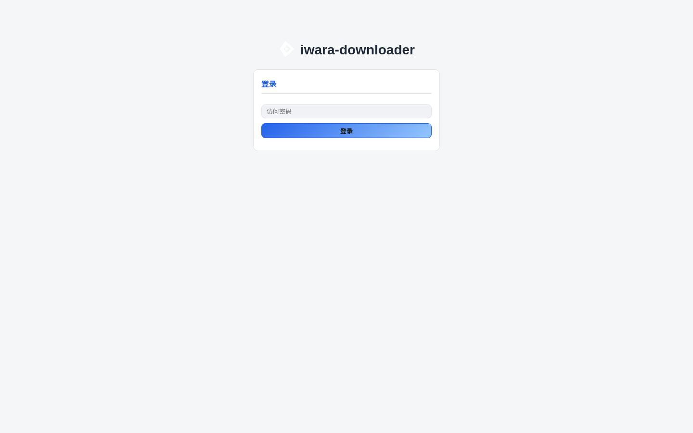
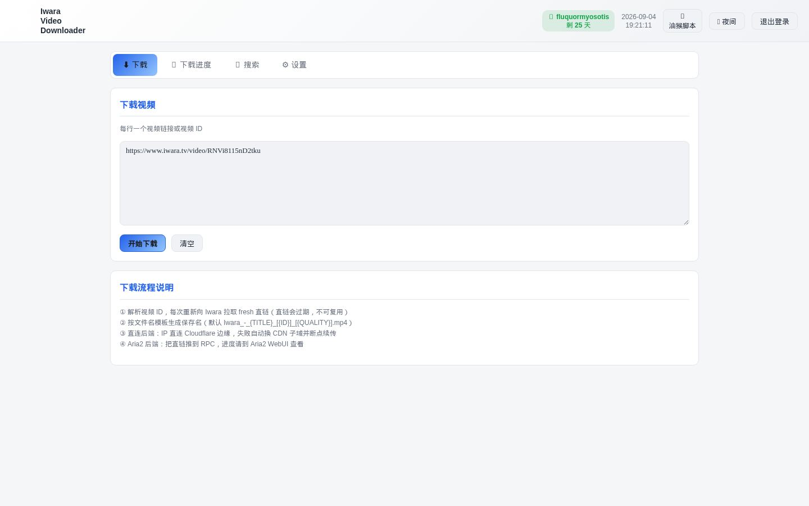
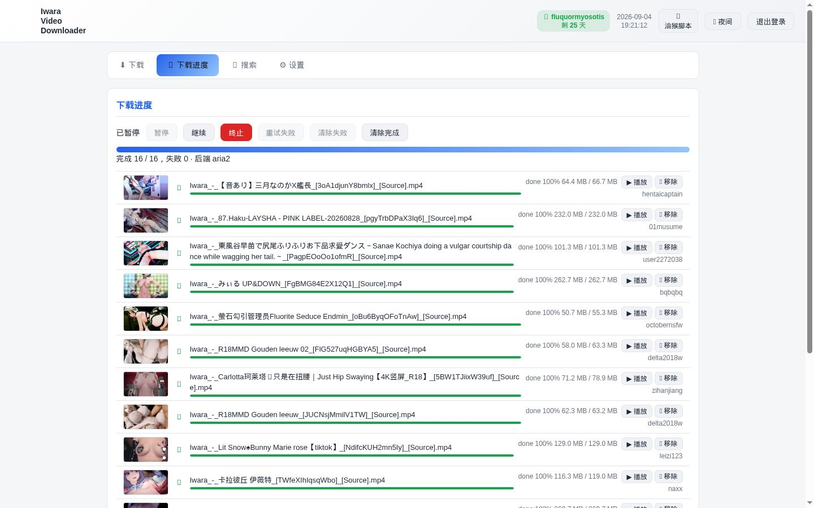
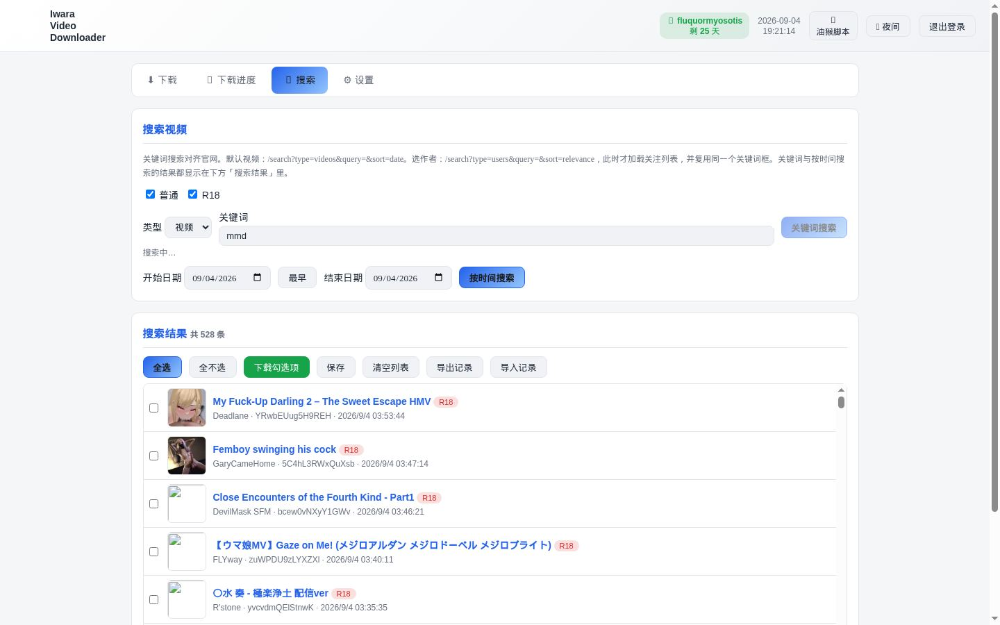
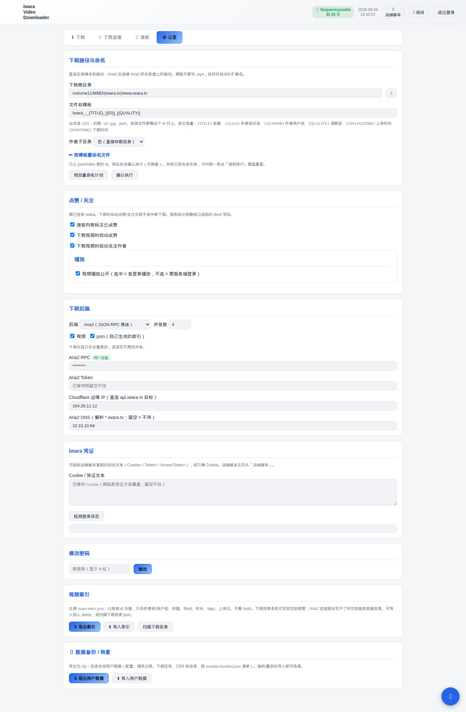
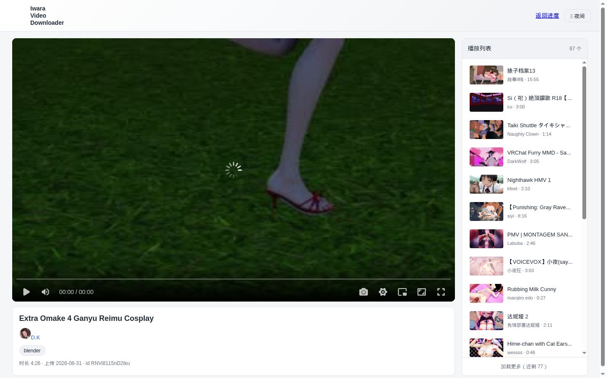
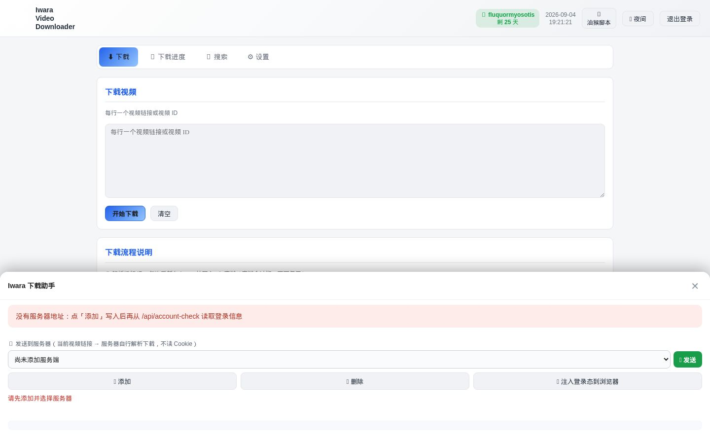

# iwara-downloader-server

> 零依赖、单进程 Node.js 服务：从 [Iwara](https://www.iwara.tv) 搜索、解析并下载视频。
> 自带网页界面（浏览器访问）。

**核心能力一览**

| 能力 | 说明 |
|---|---|
| 🔍 关键词搜索 | 走 Iwara 网页同款 `/search?type=videos&query=`，结果与官网一致 |
| ⬇ 批量下载 | 输入视频 ID / 完整链接，预解析后一键下载 |
| 🔑 凭证双模式 | Cookie / Token（油猴脚本一键采集） |
| 📤 发送到服务器 | 油猴脚本把当前视频链接一键推给服务器添加下载任务（服务端清单：添加后下拉选择，不能改只能删） |
| ▶ 本地播放 | 进度页打开 `play.html`（吸收 ArtPlayer MIT 静态文件，非 npm 依赖）：完整文件或 `.part` 已写入字节都能 Range 播；未下完时进度条只到已缓存部分；右侧索引列表滚动懒加载 |
| 🌐 CF 绕过 | IP 直连（`config.json` 的 `iwaraCfgIp`，默认 `104.26.12.12`）+ SNI + 精简 UA，绕开 DNS 污染与 Cloudflare 拦截 |
| 🔄 CDN 子域轮换 | 失败自动换可用子域；成功/失败列表持久化到本机 |
| 📁 文件名模板 | 学油猴脚本变量替换：`Iwara_-_{TITLE}_[{ID}]_[{QUALITY}]`（不要写 `.mp4`，落盘自动补） |
| 🚀 双下载后端 | `direct`（Node 直连，断点续传）/ `aria2`（JSON-RPC 推送） |
| 📦 启停脚本 | 单脚本子命令 `start.sh [start|stop|restart|status]` + 兼容薄壳 + macOS/Windows 版 |
| ❤️ 收藏 / 关注 | 下载自动点赞/关注（`autoLike` / `autoFollow`）；搜索列表与本地播放页显示真实「已赞 / 已关注」状态（官方列表接口恒返回 liked=false，本服务用本地 `liked_state` 记录并合并展示）；播放页可手动收藏视频 / 关注作者 |
| 👤 作者头像 | 本地 `avatar/<id>/<id>.jpg` 全链路：播放页作者区显示头像圆图；搜索 / 下载自动更新作者索引（`json/profile/`）与头像文件；官方无头像的作者保持空并正确跳过 |

---

## 快速开始

**环境要求**：Node.js 18+（零 npm 依赖，无需安装任何包）。

```bash
# 1. 下载 / 克隆仓库
git clone <仓库地址> && cd iwara-downloader-server

# 2. 复制配置模板（真实配置含凭证，不会入库）
cp server/config.example.json server/config.json
# 编辑 server/config.json：填 iwaraToken 或 iwaraCookie、downloadPath

# 3. （可选）设置访问密码
node server/boot.cjs --set-password "你的密码"

# 4. 启动（无参默认 restart；未运行会直接启动）
./start.sh
# 浏览器打开 http://127.0.0.1:8643
```

> 未设置密码时**只警告、可直接使用**（局域网内任何人可访问，建议尽快设置）。
> 首次启动若没有 `config.json`，会按 `config.js` 的默认值运行；正式使用请从 example 复制后再填路径与凭证。

**启停（POSIX 用 `start.sh`，Windows 用 `start-windows.bat`）**

| 命令 | 作用 |
|---|---|
| `./start.sh` | 重启（默认命令，等价 restart；未运行则直接启动） |
| `./start.sh start [--port 8643]` | 启动（`--port` 优先，缺省读 config.json 的 `port`，再缺省 8643） |
| `./start.sh restart [--port 8643]` | 重启（stop + sleep 1 + start） |
| `./start.sh stop` | 停止（PID 优雅停止 → 兜底清理残留进程） |
| `./start.sh status` | 状态（进程 / PID 文件 / HTTP 健康检查 / 日志） |
| `./start.sh --port 8643` | 兼容旧用法（等价 restart） |
| `./start.sh --set-password "新密码"` | 设置访问密码（不启动服务） |

PID 文件：项目根 `iwara-downloader-server.pid`（不入库）。

`start-linux.sh` / `start-macos.sh` / `start-windows-background.bat` 是薄壳，转发到上面两个主入口。旧名 `stop.sh` / `restart.sh` / `status.sh` 若仍存在，同样转发到 `start.sh`。

终端会自动用绿/黄/红提示（管道或 `NO_COLOR` 时关闭）。日志超过 10MB 在 start/restart 时轮转并 gzip。启动前校验 `server/config.json` 是否为合法 JSON、端口是否在 1–65535。

---

## 网页界面

四个选项卡：**⬇ 下载 / 📊 进度 / 🔍 搜索 / ⚙ 设置**。

| 选项卡 | 功能 |
|---|---|
| 下载 | 每行一个视频 ID 或 `iwara.tv/video/xxxxxx` 链接；可先「预解析」再「开始下载」 |
| 进度 | 暂停 / 恢复 / 停止 / 重试失败；任务不会自动清掉，只能手动从列表移除（不删文件）；每条可本地播放（ArtPlayer，未下完也可播已缓存部分） |
| 搜索 | 关键词（与官网 `?query=` 一致）、排序、可选用户名；勾选后下载 |
| 设置 | 下载路径、文件名模板、作者子目录、后端、Cookie / Token、密码 |

---

## 目录结构

```
├── start.sh / start-macos.sh / start-windows.bat / start-windows-background.bat  # 启停脚本（单脚本子命令）
├── stop.sh / restart.sh / status.sh    # 兼容薄壳 → start.sh
├── scripts/iwara-cred-fetch.user.js  # 油猴凭证采集 + 一键发送
├── userdata-manifest.json            # 用户数据文件清单（备份/恢复按此收集）
└── server/
    ├── app.js                        # 项目 HTTP 入口（装配 + 鉴权门 + 静态 + 启动）
    ├── boot.cjs                      # 零依赖启动器（强制本项目 .js 按 CommonJS 加载）
    ├── config.js                     # 项目配置读取
    ├── config.example.json           # 配置模板（入库）；真实 config.json 不入库
    ├── routes/                       # 项目路由，按域拆分（12 个）
    │   └── auth.js browse.js search.js download.js play.js rename.js
    │       videos.js settings.js account.js data.js index.js auto-update.js
    ├── lib/                          # 项目模块 + 通用运行支撑件
    │   ├── iwara-api.js              # Iwara API（IP 直连 + CF 绕过）
    │   ├── downloader.js             # 下载引擎（direct / aria2 + 子域轮换）
    │   ├── cjs-bootstrap.cjs         # CJS 强制（boot.cjs 与 test/ 共用，模板下发）
    │   └── start.sh                  # 启停脚本本体（模板下发，根目录 start.sh 为入口）
    ├── core/ auth/ config/ http/     # 框架通用件，按功能分层（模板下发）
    │   route/ store/ update/ assemble/
    └── public/                       # 网页前端
```

> `core/` `auth/` `config/` `http/` `route/` `store/` `update/` `assemble/` 与
> `boot.cjs`、`lib/cjs-bootstrap.cjs`、`lib/start.sh` 由 `dl-server-template` 组装下发，
> 本仓库不手工维护；`routes/`、`lib/` 下的其余文件与 `app.js` 是本项目自有代码。
> 二者区分：框架件按功能子目录（`http/path-safe.js`），项目件按领域（`lib/downloader.js`）。

---

## 配置（server/config.json）

记录：**端口、凭证、下载路径、文件名模板、后端（direct / aria2）**。

```json
{
  "port": 8643,
  "iwaraToken": "",
  "iwaraCookie": "",
  "downloadBackend": "direct",
  "downloadPath": "/path/to/your/Iwara/",
  "fileNameTemplate": "Iwara_-_{TITLE}_[{ID}]_[{QUALITY}]",
  "useAuthorSubdir": false
}
```

> ⚠️ **安全说明**：仓库只提交 `server/config.example.json`（示例路径、空凭证）。
> 真实配置（含 token / cookie / 本机路径 / 密码哈希）保存在本地 `server/config.json`，已被 `.gitignore` 忽略，**不会上传**。
> 首次使用：复制 example 为 `config.json` 后填写，或在网页「设置」中保存。

| 字段 | 说明 |
|---|---|
| `iwaraToken` | Iwara refresh_token（油猴脚本复制） |
| `iwaraCookie` | 完整 Cookie（含 cf_clearance；HttpOnly 需油猴 `GM_cookie`） |
| `downloadBackend` | `direct`（默认）或 `aria2` |
| `downloadPath` | 下载根目录。`direct` 为本机路径；`aria2` 为 **aria2 所在机器**上的路径 |
| `fileNameTemplate` | 文件名模板，变量见下表 |
| `useAuthorSubdir` | 是否按作者建子目录（默认 `false`） |
| `concurrency` | 直连并发数 |
| `aria2Path` | Aria2 JSON-RPC 地址 |
| `aria2Token` | Aria2 RPC 密钥（不含 `token:` 前缀，代码会自动加） |
| `port` | HTTP 端口（默认 8643） |

**文件名模板变量**（学油猴脚本 `downloadPath.ts`）：

| 变量 | 含义 |
|---|---|
| `{TITLE}` | 标题 |
| `{ALIAS}` | 别名 |
| `{ID}` | 视频 ID |
| `{AUTHOR}` | 作者 |
| `{QUALITY}` | 清晰度（如 Source / 540） |
| `{UPLOADTIME}` | 上传时间 |
| `{NOWTIME}` | 当前时间 |

默认：`Iwara_-_{TITLE}_[{ID}]_[{QUALITY}]`（不要写扩展名，落盘自动补 `.mp4`）  
**必须含 `{ID}`**：封面 `server/thumbs/<id>.jpg`、sidecar json、视频文件都靠这个 id 对上。设置页保存时缺 `{ID}` 会拒绝。  
例：`Iwara_-_耀佳音与知更鸟摇一摇_[ZsvQjWn9XNQvAy]_[Source].mp4`

---

## 凭证获取

浏览器安装 `scripts/iwara-cred-fetch.user.js`（或打开服务器 `/userscript`）：

1. 打开并登录 [iwara.tv](https://www.iwara.tv)（等 Cloudflare 挑战完成）
2. 点页面右下角 🎫 按钮
3. 一键复制完整 Cookie / Token，粘贴到网页「设置」保存

---

## 发送到服务器（一键把视频推给服务器下载）

油猴脚本（v7.1.0+）「📤 发送到服务器」：

1. 打开任意 iwara 视频页（如 `https://www.iwara.tv/video/eBTWBPRSTFkahe`）
2. 点右下角 🎫 按钮，填服务器地址（`192.168.1.10:28463` 或 `http://192.168.1.10:28463` 均可，没写协议会自动补 `http://`），点 **📤 发送**
3. 脚本行为：
   - 探测 `GET /api/status`；
   - 服务器设了密码则用本地保存的服务器密码 `POST /api/login` 自动登录；
   - 把**当前视频完整链接** `POST /api/receive`（内部转发给 `/api/download`，服务器自行解析 ID 并下载）；
   - 地址/密码可「💾 记住地址」固化。
4. 面板顶部按香蕉网脚本风格显示登录态：已登录 / 用户名 / 用户 id / 主页链接 / Cookie 诊断。

> `/api/receive` 接受 `{ url }` / `{ urls }` / `{ items }` / `{ text }`，解析只走 `/api/download` 一处。

---

## 作者头像与索引（完整流程）

播放页作者区头像走**本地全链路**：`json/profile/<username>.json` 索引记录作者信息（`name` / `profile` / `avatar` 相对路径），头像文件存在项目根 `avatar/<id>/<id>.jpg`，前端 `renderAuthor` 渲染 ``。官方 API 一律不直接透传头像 URL，只取头像 id 拼本地路径。

**1. 索引如何建立 / 更新（自动，无需手工）**

- 搜索时：`search-cache.js` 写搜索缓存时调 `profileIndex.upsertFromVideo(v)`，新作者自动建索引；
- 下载时：`downloader.js` 的 `prepareVideoInfo` 调 `profileIndex.upsertFromInfo(info)`；
- 启动时：`downloader.js` 模块加载末尾调 `profileIndex.backfillMissing()`，为「已下载但没建索引」的作者补索引（只补 json 缺失的作者，不重查已有索引）。
- `upsertFromUser` 的更新策略：**文件已存在且 `name` 没变就跳过**（不重查官方），除非 name 变了或文件缺失。头像字段提取官方 `user.avatar.id` → 拼 `/avatar/<id>/<id>.jpg` → 若本地文件缺失则 `saveAvatarFile` 下载（`GET /image/avatar/<id>/<id>.jpg`，写入 `avatar/<id>/<id>.jpg`，`.part` 临时文件 + rename，32B 以下或官方占位图丢弃）。写索引后同步 `patchCatalog` 更新总表 `json/profile/iwara-profile.json`。

**2. 播放页如何取头像**

`/api/play-info` 的 `avatar` 字段：`profileIndex.readEntry(username)` → `avatar` → `avatarExists(rel)`（文件存在且 >32B）→ 返回相对路径 `/avatar/<id>/<id>.jpg`。前端 `renderAuthor`：字段非空且匹配 `/^\/avatar\/[0-9a-f-]+\/[0-9a-f-]+\.jpg$/i` 才渲染 ``，图片 onerror 自动隐藏。

**3. 已知边界（实测确认）**

- **官方 avatar=null 的作者**（如 jk4、hannana298）：本地索引 avatar 为空是**正确行为**，不是漏下载——官方 `GET /profile/{u}` 的 `user.avatar` 就是 null。前端不渲染头像，页面作者区只显示名字。
- **官方后上传头像不自动刷新**：因「文件已存在且 name 没变就跳过」，若某作者先以无头像建了索引、官方后来才上传头像，本地不会自动补拉。需删除 `json/profile/<username>.json` 或等 name 变化才会重查。
- **头像文件缺失但索引有值**：`saveAvatarFile` 下载失败（网络 / 官方 404）时索引仍会写入 avatar 路径，但 `avatarExists` 校验失败 → play-info 返回空 → 前端不渲染，不影响其它功能。
- 前端脚本语义验证：`test/test-author-avatar.cjs` 以 jsdom `<script>` 内联方式（真实浏览器 script 语义，非 `win.eval`）加载真实 `play.html` body + `play-list.js` / `play-enhance.js` / `play-app.js` 三件套，断言 `#author` 渲染 `` 且无 JS 报错；新旧项目 `renderAuthor` 同数据渲染对比。

---

## 下载后端

### direct（默认）

本机 Node 直连下载：每次重新解析 **fresh 直链**（链接会过期），IP 直连 Cloudflare 边缘，失败自动换 CDN 子域。支持 Range 断点续传。

### aria2

把 fresh 直链通过 JSON-RPC `aria2.addUri` 推给 aria2。`downloadPath` 必须是 **aria2 机器上的路径**。

群晖 DSM Aria2 套件示例：

```json
{
  "downloadBackend": "aria2",
  "aria2Path": "https://nas.local:5001/webman/3rdparty/Aria2/aria2rpc_proxy.cgi",
  "aria2Token": "你的RPC密钥",
  "downloadPath": "/volume1/downloads/"
}
```

aria2 进程自己做 DNS。若本机 DNS 污染 iwara 子域，需在 **aria2 所在机器** 配 hosts，或用群晖 **DNS Server** 套件把 `iwara.tv` 通配 A 记录指到 `104.26.12.12`，并把该机系统 DNS 指到本机 `127.0.0.1`。常见处理见下方「常见问题」。

---

## 版本

> 版本记录已**外置**到 **[docs/CHANGELOG.md](docs/CHANGELOG.md)** —— 由 dsh-git-push 插件的 `doc-version`
> 从 git log 聚合（`apply` 更新 / `check` 查漂移，可接 CI），启用该工具前的历史版本一并保留在该文件里。

## 界面截图

实际运行界面（`http://nas.local:28463`，Chromium 无头 CDP 截取）。Cookie / Token 已打码。

| 页面 | 说明 |
|---|---|
| [登录](docs/screenshots/01-login.jpg) | 访问密码登录 |
| [下载](docs/screenshots/02-download.jpg) | 批量粘贴视频链接 / ID |
| [下载进度](docs/screenshots/03-progress.jpg) | 任务列表、暂停/继续/重试、本地播放 |
| [搜索](docs/screenshots/04-search.jpg) | 关键词搜索（对齐官网 `/search?query=`） |
| [设置](docs/screenshots/05-settings.jpg) | 路径、文件名模板、后端、凭证 |
| [本地播放](docs/screenshots/06-play.jpg) | `/{id}` 播放页（作者名前头像、右侧列表） |
| [油猴脚本](docs/screenshots/07-userscript.jpg) | 页面右下角面板：发送到服务器 |









## 用户数据（不入库）

清单见 `userdata-manifest.json`。主要包括：

| 文件 | 说明 |
|---|---|
| `server/config.json` | 凭证、路径、密码 |
| `json/download_task.json` | 任务进度 |
| `json/cdn_hosts_state.json` | CDN 成功/失败子域（运行中自动写） |
| `json/search_cache.json` / `search_task.json` | 搜索记录与按时间搜索任务 |
| `json/following_cache.json` | 关注列表增量缓存（`syncFollowedAll` 用） |
| `json/liked_state.json` | 本地已赞 / 已关注状态（搜索 badge 与播放页按钮兜底） |
| `json/profile/` | 作者信息索引（含总表 `iwara-profile.json`） |
| `avatar/<id>/<id>.jpg` | 作者头像文件（搜索/下载自动更新） |
| `server/server.log` | 日志 |

备份时按清单复制即可；不要把这些文件提交到 git。

---

## 常见问题

**Q: 未设置密码能直接用吗？**  
A: 可以（只警告）。局域网内任何人可访问，建议 `node server/app.js --set-password "密码"`。

**Q: 下载的视频在哪？**  
A: `config.json` 的 `downloadPath`。`useAuthorSubdir: true` 时为 `<root>/<作者>/<文件名>`，默认否，直接 `<root>/<文件名>`。

**Q: 搜索「奥黛塔」结果不对？**  
A: 必须走 `/search?query=`（与官网 `https://www.iwara.tv/search?type=videos&query=奥黛塔` 一致），不要用 `/videos?search=`。当前版本已按官网 API。

**Q: 下载 403？**  
A: 常见原因：① 直链过期（必须每次重新获取，不要复用旧 URL）② UA 用了完整 Chrome（带 AppleWebKit）会被 CF 拦，必须用精简 UA ③ CDN 子域被挑战（会自动换子域）。常见处理见下方「常见问题」。

**Q: Cookie / Token 会不会被推到 GitHub？**  
A: 不会。`server/config.json` 已 gitignore。仓库只有空凭证的 `config.example.json`。

**Q: GitHub 推送凭据放哪？**  
A: 由 dsh-git-push 插件托管，无需在项目里放 token 文件。

---

## 踩坑记录（原 TROUBLESHOOTING.md，已并入）

> 开发/部署过程中踩过的坑与最终有效方案。以下任一环节出问题时先看本节。

### 1. User-Agent 规律（最容易反复踩的坑！）

**必须用「精简 UA」，绝不能用「完整 Chrome UA」。**

| 请求体 | UA | 结果 |
|---|---|---|
| Node https | 完整 UA（含 `AppleWebKit/537.36 (KHTML, like Gecko)`） | ❌ 403（CF 挑战） |
| Node https | 精简 UA `Mozilla/5.0 (Windows NT 10.0; Win64; x64) Chrome/126.0.0.0 Safari/537.36` | ✅ 200/401 通过 |
| curl / aria2 无 UA | `aria2/1.37.0` 等 | ❌ 403 |
| aria2 带精简浏览器 UA | 同精简 UA | ✅ 通过 |

精简 UA 标准值（`DEFAULT_UA`，`server/lib/iwara-api.js`）：

```
Mozilla/5.0 (Windows NT 10.0; Win64; x64) Chrome/126.0.0.0 Safari/537.36
```

不要加回 `AppleWebKit/537.36`，也不加 `X11; Linux x86_64` 等扩展——越精简越稳。适用位置：iwara-api.js 的 API 请求、downloader.js 的 direct 下载、**aria2 推送必须带 UA**（默认 UA 被 CF 403）。

### 2. Cloudflare 挑战绕过：IP 直连 + SNI + Host

iwara.tv 全套在 Cloudflare 后面且 DNS 被污染：
1. 不通过系统 DNS 解析，直连 Cloudflare 边缘 IP（`config.json` 的 `iwaraCfgIp`，默认 `104.26.12.12`）
2. TLS 用 `servername: <真实域名>` 保留 SNI
3. HTTP 头带 `Host: <真实域名>` 让虚拟主机识别
4. UA 用精简版（见上）

```js
https.request({
  host: api.getCfIp(),        // 读配置 iwaraCfgIp，代码不写死
  servername: "api.iwara.tv", // TLS SNI 保持域名
  headers: { Host: "api.iwara.tv", "User-Agent": DEFAULT_UA, ... }
})
```

**Node 版本比 Cookie 更关键**：Node 24（项目自带 `tool/node`）✅ 200/401；群晖 Node.js_v22 套件、curl 7.86 ❌ 403 `cf-mitigated: challenge`。Aria2 能下视频 ≠ API 能登录（aria2 打 CDN 文件站，登录走 api.iwara.tv）。

### 3. DNS 污染

系统 DNS（阿里 223.5.5.5/223.6.6.6）把 iwara CDN 子域解析到 Facebook/Twitter IP 段；8.8.8.8/1.1.1.1 结果也各不相同且不可靠。**不要试图修复 DNS，一律 IP 直连 104.26.12.12**。若必须走 DNS（如 aria2 独立进程）：群晖 DNS Server 套件建主区域 `iwara.tv` 加通配 A 记录 `* → 104.26.12.12`；aria2 用运行机 DNS，须让群晖 DNS 指向 127.0.0.1。

### 4. 下载链接会过期（必须每次重新获取）

downloadUrl 带 `expires` 参数，**几分钟内过期**；每次下载必须重新调用 `getVideoInfo(id)` 获取 fresh 链接（`runDownloadLoop` 里 direct/aria2 两分支都已先获取再下载），旧链接 → 403/404。

### 5. CDN 子域名差异（动态列表）

同一 IP 下不同 CDN 子域结果不同：`api`/`www`/`firefly`/`aiko`/`filesq`/`pela`/`phoebe`/`topaz` ✅，`naja` 等部分 403。downloadUrl 子域随机轮换 → **动态子域列表**（`server/cdn_hosts_state.json`）：GOOD 成功列表优先、BAD 失败列表自动跳过、失败自动换子域重试。注意子域替换只对未过期链接有效。

### 6. aria2 后端要点

- RPC 兼容 DSM 代理：`https://<NAS>:5001/webman/3rdparty/Aria2/aria2rpc_proxy.cgi`
- token 用 `params: ["token:xxx", ...]` 前缀方式；必须带精简浏览器 UA；DSM 自签名 → `rejectUnauthorized: false`
- 下载路径用 aria2 的 `dir` 选项传 NAS 路径；aria2 独立进程，提交后无法追踪进度，只标记 `submitted`

### 7. Node 24 的坑（程序化 DNS 全部失败，别再用）

自定义 `lookup` 回调 → `Invalid IP address: undefined`；`dns.resolve4Sync` → not a function；`dns.setServers` 后 resolve 仍失败。**结论：不需要任何 DNS 编程，全部 `host: 104.26.12.12` IP 直连。**

---


---

## TODO

### 封面状态机

当前封面生成逻辑：视频文件不存在 → 不生成；存在 → 抽帧覆盖。

**待实现：引入「状态机」解耦 video_status 和 cover_status**

- video_status：pending → transcoding → available / unavailable（源文件丢失）
- cover_status：empty → generating → done / failed

生成条件：video_status = available 且 cover_status != done

好处：
- 错误封面不再占位（cover_status=done 但 video_status=unavailable 时不生成）
- 视频源恢复后自动触发重新生成
- 避免每次播放都重复抽帧


---
- cover_status：empty → generating → done / failed

生成条件：video_status = available 且 cover_status != done

好处：
- 错误封面不再占位（cover_status=done 但 video_status=unavailable 时不生成）
- 视频源恢复后自动触发重新生成
- 避免每次播放都重复抽帧

## License

MIT
